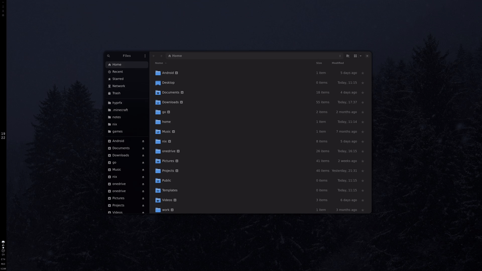
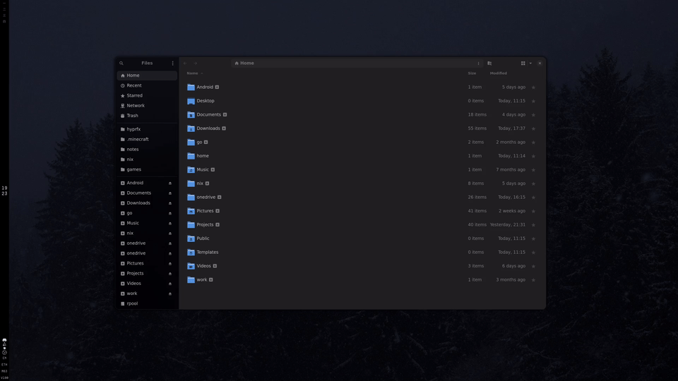

# hyprfx

my attempt at bringing [Burn-My-Windows](https://github.com/Schneegans/Burn-My-Windows) style shaders to Hyprland

for now, this basically an exact port, meaning only animations on window close events, but im thinking of more features in the future? idk

## effects

| Effect | Preview |
|--------|---------|
| Aura Glow |  |
| Broken Glass |  |
| Blur |  |
| Glide |  |

> [!CAUTION]
> i don't know what im doing
>
> also, shaders are mostly adapted from [Burn-My-Windows](https://github.com/Schneegans/Burn-My-Windows) using an LLM since there's no way im learning shaders just for this silly plugin
